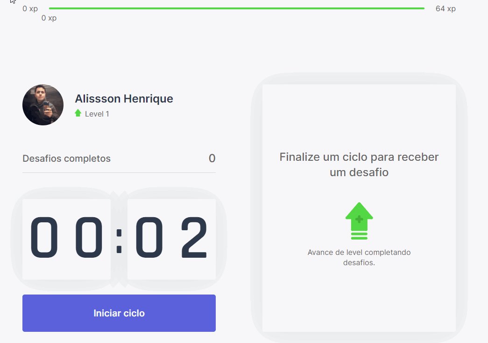

<h1 align="center">
    
</h1>

  <a href="#-tecnologias">Technologies</a>&nbsp;&nbsp;&nbsp;|&nbsp;&nbsp;&nbsp;
  <a href="#-projeto">Project</a>&nbsp;&nbsp;&nbsp;|&nbsp;&nbsp;&nbsp;
  <a href="#-layout">Layout</a>&nbsp;&nbsp;&nbsp;|&nbsp;&nbsp;&nbsp;

  
  
   
  

 
 

  

## 👨🏻‍💻 Technologies

This project was developed with the following technologies:

- [NextJs](https://nextjs.org/)
- [TypeScript](https://www.typescriptlang.org/)

### :rocket: How to install and start

- `git clone https://github.com/AlissonHenrique/Moveit`
- **Go to repository folder**
- `yarn or npm`
- `yarn dev or npm dev`

## 💻 Project

The Move.it is an application in the format of a game to develop some physical activities during the day 💜

## 🔖 Layout

In the links below you will find the layout of the web project. Remembering that you need to have an account at [Figma](http://figma.com/) to access it.

- [Layout Web](https://www.figma.com/file/pVUC6keNOBk0dSWqdagkgP/Move.it-2.0)

## :memo: License

This project is under MIT license. See the [LICENSE](https://github.com/AlissonHenrique/Moveit/blob/main/LICENSE) for more information. .
